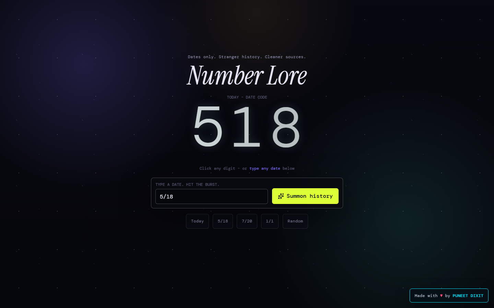

# Number Lore

Date-first history interface. Type `5/18`, `7/20`, `2026-05-18`, or any other date and the app pulls stronger on-this-day facts into animated cards with number rain.



## What Changed

- No fixed navbar; the opening screen is just the title, live date code, and search controls.
- Result cards sit below the first viewport so the start screen stays focused.
- Facts come from Wikimedia On This Day, HistoryLabs, Day in History, and ZenQuotes, with local fallbacks.
- Provider text is cleaned before rendering so raw HTML and wiki math markup do not leak into cards.

## Run Locally

```bash
npm install
npm run dev
```

## Test

```bash
npm run test
npm run build
npm run test:e2e
```

## Vercel

Use the default Vite settings:

- Build command: `npm run build`
- Output directory: `dist`
- Environment variables: none

The browser calls public date-history APIs directly. API Ninjas support is prepared as a URL builder only because live use requires your API key.
